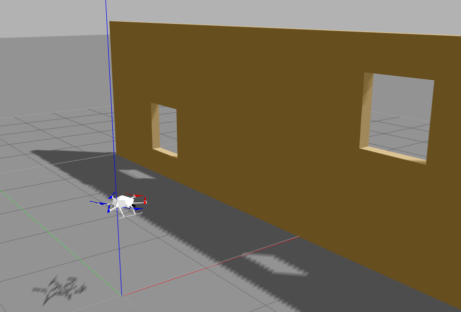
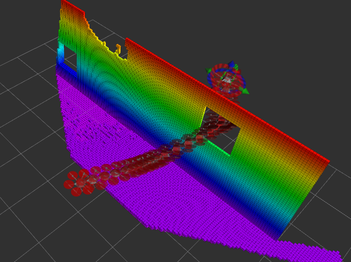
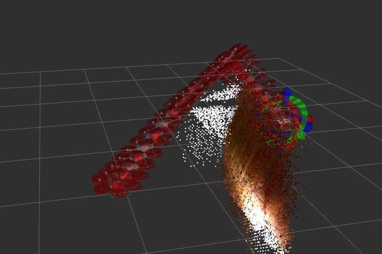

## State UAV Navigation with AscTec Firefly and Realsense R200 Camera


This repository implements the 3D Localisation, Mapping and reactive Pathplanning/Pathfollowing of the AscTec Firefly with a mounted Realsense R200 Camera.

- For the 3D Localisation we create position data using extended kalman filtered signals from the firefly-IMU(inertial measurement unit) and camera-VO(Visual Odometry). The IMU is already embedded in the Firefly. Visual odometry is created from the realsense R200 camera.

- 3D Mapping was first implemented with octomap and the simulation still uses octomap. In the final version for the real world implementation we use however RTAB-Map (Real-Time Appearance-Based Mapping) instead which has more features. But any other similar occupancy grid mappings would also work. Using different depth cameras instead of the realsense r200 is also possible.

- The reactive Pathplanning is implemented with the OMPL(Open Motion Planning Library) in Moveit!(Motion Planning Framework) using the real-time generated maps from RTAB-Map. 

- For the Pathfollowing we use the generated obstacle avoiding paths and create custom controller signals for the AscTec Firefly.


### Installation Instructions for Ubuntu 16.04 with ROS Kinetic


1. Install and initialize ROS kinetic desktop full.

2. Install additional packages:

```
$ sudo apt-get install ros-kinetic-moveit ros-kinetic-rtabmap-ros ros-kinetic-mavlink ros-kinetic-robot-pose-ekf ros-kinetic-octomap-ros ros-kinetic-joy python-wstool python-catkin-tools protobuf-compiler libgoogle-glog-dev ros-kinetic-control-toolbox
```

3. Install realsense r200 camera by following instructions on:

http://wiki.ros.org/realsense_camera

4. Create and build catkin workspace with the project:

```
$ mkdir -p ~/catkin_ws/src
$ cd ~/catkin_ws/src
$ git clone https://github.com/nihsal/uav_navigation.git
$ git clone https://github.com/ethz-asl/mav_comm.git
$ cd ~/catkin_ws/
$ catkin build
```

In case of "error no module future":

```
$ sudo apt-get install python-pip
$ pip install future
```

5. Add sourcing to your `~/.bashrc` file:

```
$ echo "source ~/catkin_ws/devel/setup.bash" >> ~/.bashrc
$ source ~/.bashrc 
```

### Usage Instructions for the Simulated Environment

```
$ roslaunch uav_navigation_bringup simulation_bringup.launch
``` 

This launch file will start a gazebo simulation of a hovering firefly with an attached r200 camera and a wall with two windows in front. 



At the same time it will start in parallel Moveit in Rviz for pathplanning. 



### Usage Instructions for the Realworld Implementation

1. Connect the r200 camera and launch:

```
$ roslaunch uav_navigation_bringup uav_bringup.launch 
``` 

This launch file will initiate the camera, generate visual odometry, create a RTAB-Map of the environment and open Moveit in RVIZ for pathplanning.



